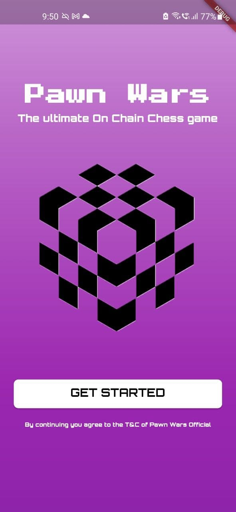
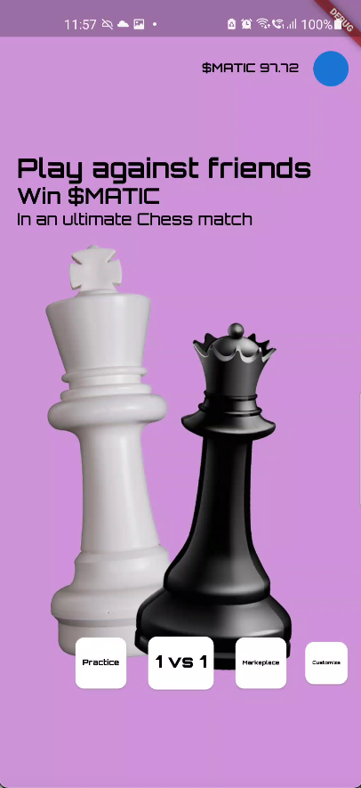
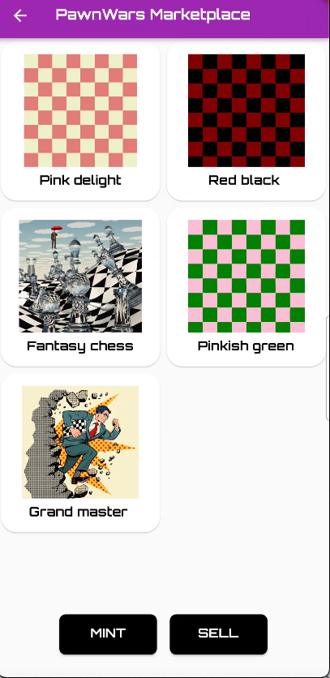
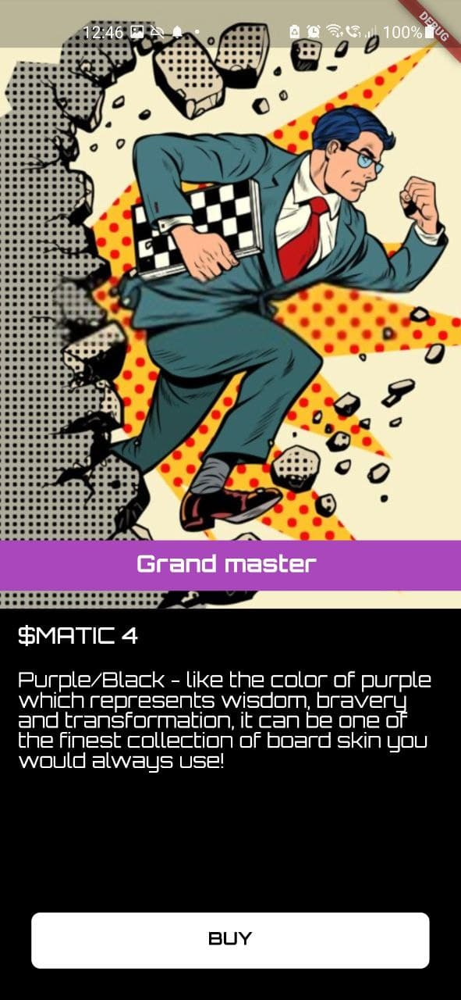
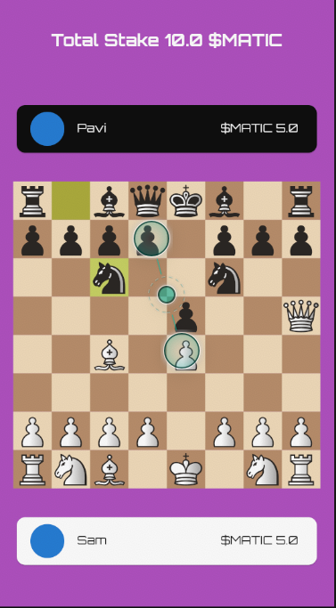
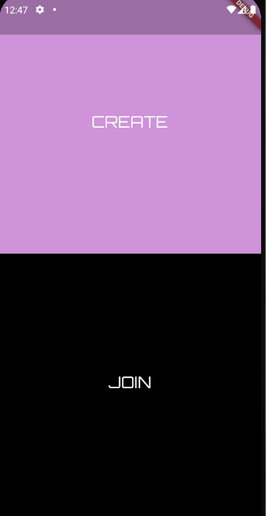
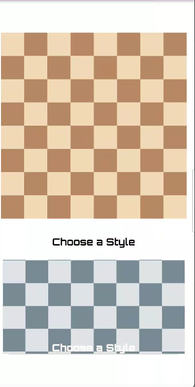
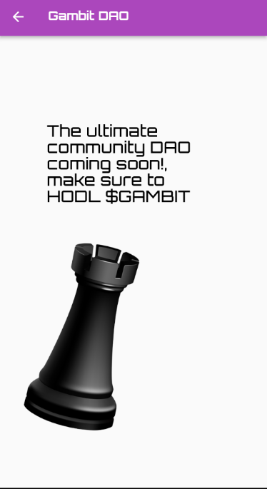
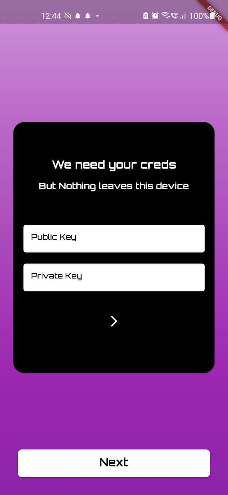
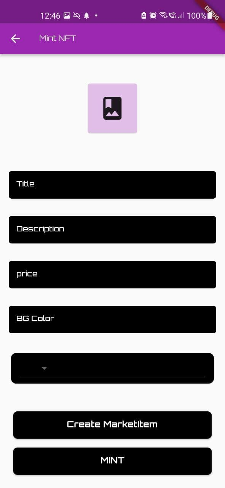

# Pawn Wars

A chess Dapp built on Polygon, Stake tokens and win $MATIC, BUY NFT powerups and chess board skins!

### Become the $GAMBIT master in Pawn Wars!!

Pawn Wars is a chess Dapp where users can practice, play one on one with friends in a wager match where winner takes all $MATIC. The app also has a built in NFT markeplace where players can mint NFT art and buy chess board skins and background color NFTs, which can be used to customize the playing board to get the most unique experince.

We believe we built one of the best mobile gaming experiences using web3 on polygon. The app is completely decentralized with data on matic and filecoin and the websocket server which holds only the concurrent state of the app deployed on stackOS.

This was truly an ultimate learning experince to build a fully integrated chess dapp with a small team.

### Screenshots

<pre>
          

</pre>

## Architecture

## Problem it Solves

- There are no incentives while playing a real-time game which for game like chess that needs skill and attention.
- Players can earn real value for their game skills and time.
- It helps to be a part of a decentralised way of betting environment through a trustless mechanism and without a 3rd party facilitator.

## Challenges we faced

- Diving into blockchain was intimidating, solidity has a high learning curve.
- Building a mobile-first web3 app was hard because of a lack of tooling for connecting and integrating with wallet.
- We started out short on time which made it very hard and challenging to integrate many features and build a functional app.
- Building a chess gaming app with a betting feature using web3 was demanding because of the complex logic.
- integrating multiple 3rd party services like stackOS, Filecoin and Matic was the trickiest part.
- We had very little blockchain knowledge and had not worked with sockets before so was a challenging learning experience.

## Enhancements

- Store all profile and game history on web3.storage.
- Builiding a chess community DAO for helping and funding community led competitions and events.
- Live in-app events.
- Support for connecting to a wallet like Trust wallet.
- Improving user experience on the game, and winning stake.

### Contributors

- Sameer @sameerkash
- Pavitra @PavitraAritas

Built with ❤️ for Web3
