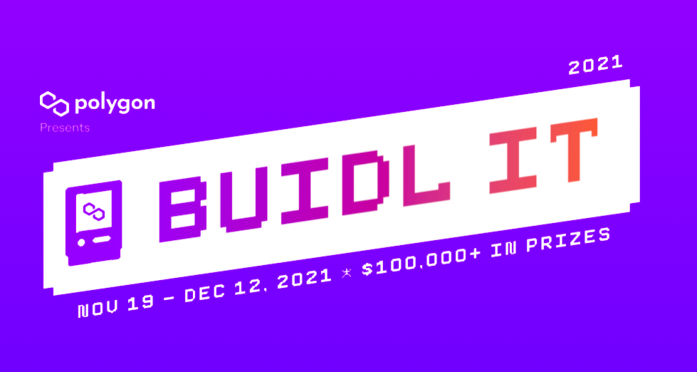

# Pawn Wars

A chess Dapp built on Polygon, Stake tokens and win $GAMBIT , BUY NFT powerups and chess board skins!

### Become the $GAMBIT master in Pawn Wars!!

## Features 
- Practice Room - Practice sessions for the beginners.
- Play with a friend - Stake MATIC and winner takes it all.
- NFT MArketplace - In-game collectibles and art masterpieces to own.
- DAO - Ultimate place for chess community.
- Customization - Decorate your board skins and show-off!

## Problem it Solves

- There are no incentives while playing a real-time game which makes it a show-stopper. 
- Players can earn real value for their game skills and time.
- To be a part of a decentralised way of betting environment.

## Challenges we faced

- Diving into blockchain was intimidating, Solidity has a high learning curve.
- Building mobile first web3 app was hard because of lack of tooling           
- We started out short on time which made it very hard and challenging to integrate many features and building a functional app.
- Building a chess gaming app with betting feature using web3 was demanding because of the complex logic
- Integrating multiple third-party services like StackOS, filecoin and MATIC was the trickiest part.

